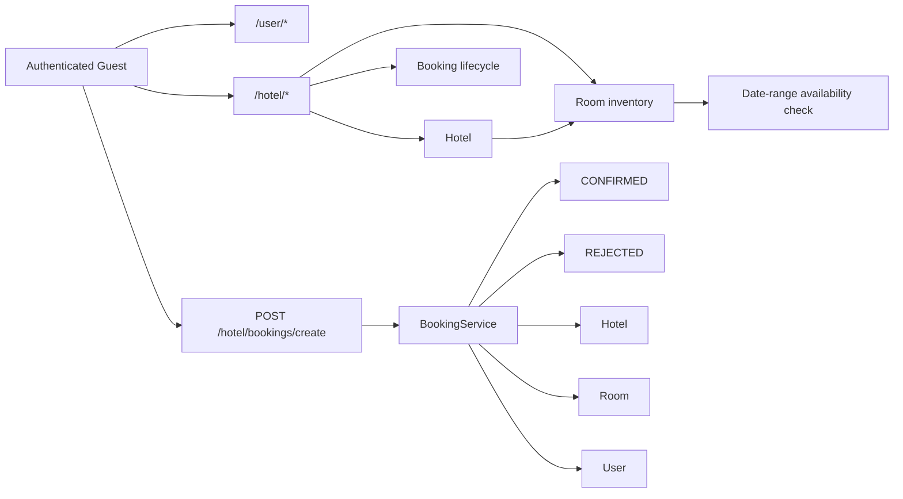

# Hotel Management API

Spring Boot REST API for managing hotels, rooms, and bookings with MySQL persistence, JWT authentication, and OAuth2 login support via Keycloak and Google.

## Overview

This release keeps the hotel-management workflow intact while refreshing the security layer and extending the domain model. The application supports Keycloak-backed JWT/resource-server access, Google OAuth2 login, and role-based endpoint protection through Spring Security annotations.

## Architecture

| Layer | Responsibility |
| --- | --- |
| API layer | Exposes hotel, room, user, and booking endpoints |
| Domain layer | Models hotels, rooms, users, and booking lifecycle states |
| Security layer | Uses JWT, OAuth2 login, and method-level authorization |
| Persistence layer | Stores hotel, room, user, and booking data in MySQL |
| View layer | Provides a Thymeleaf login page for browser sign-in |

## Concepts and Features Covered

- Spring Boot REST API setup
- Spring Data JPA repository pattern
- MySQL-backed persistence
- Spring Security with JWT resource-server support
- OAuth2 login with Keycloak
- OAuth2 login support for Google
- Method-level authorization with `@PreAuthorize`
- Public user registration and user listing
- Hotel creation, retrieval, listing, and deletion endpoints
- Room management for hotel inventory
- Booking creation with request/confirm/reject statuses
- Date-range validation for room availability
- `/login` custom page backed by Thymeleaf
- Google user authority mapping from the local user table

## Tech Stack

- Java 17
- Spring Boot 3.3
- Spring Web
- Spring Data JPA
- Spring Security
- Spring Validation
- Spring OAuth2 Client
- Spring OAuth2 Resource Server
- Thymeleaf
- MySQL
- Maven
- Lombok
- JJWT

## Project Structure

```text
hotel/
├── CHANGELOG.md
├── README.md
├── pom.xml
├── mvnw
├── mvnw.cmd
└── src/
    └── main/
        ├── java/com/cn/hotelDemo/
        │   ├── config/
        │   ├── controller/
        │   ├── dto/
        │   ├── model/
        │   ├── repository/
        │   ├── service/
        │   └── HotelDemoApplication.java
        └── resources/
            ├── application.yml
            └── templates/
                └── login.html
```

## How to Run

1. Open a terminal in the project root.
2. Update MySQL, Keycloak, and Google client settings in `src/main/resources/application.yml` if needed. The Google entries are placeholders in the published template.
3. Run `mvn test`.
4. Run `mvn spring-boot:run`.
5. Open `http://localhost:8082/login` for the custom login page.
6. Use the API under `http://localhost:8082`.

Available endpoints:

- `GET /login`
- `GET /hotel/userDetail`
- `POST /hotel/create`
- `GET /hotel/id/{id}`
- `GET /hotel/getAll`
- `DELETE /hotel/remove/id/{id}`
- `POST /hotel/rooms/create`
- `GET /hotel/rooms/id/{id}`
- `GET /hotel/rooms/hotel/{hotelId}`
- `GET /hotel/rooms/getAll`
- `POST /hotel/bookings/create`
- `GET /hotel/bookings/id/{id}`
- `GET /hotel/bookings/getAll`
- `GET /hotel/bookings/user/{userId}`
- `GET /hotel/bookings/hotel/{hotelId}`
- `GET /user/getUsers`
- `GET /user/getUsers/{id}`
- `POST /user/createUser`
- `DELETE /user/remove/id/{id}`

Access notes:

- `/login` is public.
- `GET /hotel/id/{id}` is for `NORMAL` users.
- `POST /hotel/create`, `GET /hotel/getAll`, and `DELETE /hotel/remove/id/{id}` are restricted to admin-style access.
- `POST /hotel/rooms/create` and `GET /hotel/rooms/getAll` are admin-only operations.
- `GET /hotel/bookings/getAll` and `GET /hotel/bookings/hotel/{hotelId}` are admin-only operations.
- `POST /hotel/bookings/create` is available to authenticated hotel users.
- `GET /hotel/userDetail` uses the authenticated OIDC principal.
- Google login uses local user-role mapping from the MySQL user table.

Example user registration body:

```json
{
  "username": "john",
  "password": "john123",
  "email": "john@example.com",
  "role": "NORMAL"
}
```

Example hotel creation body:

```json
{
  "name": "Sea View Inn",
  "rating": 8,
  "city": "Goa"
}
```

Example room creation body:

```json
{
  "hotelId": 1,
  "roomNumber": "101",
  "roomType": "Deluxe",
  "capacity": 2,
  "nightlyRate": 4500.00,
  "status": "AVAILABLE"
}
```

Example booking creation body:

```json
{
  "hotelId": 1,
  "roomId": 1,
  "userId": 2,
  "checkInDate": "2026-06-05",
  "checkOutDate": "2026-06-08",
  "guestCount": 2,
  "specialRequests": "Late check-in"
}
```

Example booking response:

```json
{
  "bookingReference": "BOOK-1A2B3C4D",
  "status": "CONFIRMED",
  "message": "Booking confirmed successfully",
  "bookingId": 10
}
```

## Flow Diagram



## GitHub Metadata

- Suggested repository description: `Spring Boot REST API for hotel, room, and booking management with MySQL persistence, JWT authentication, and OAuth2 login support via Keycloak and Google.`
- Suggested topics: `java`, `java-17`, `spring-boot`, `spring-security`, `spring-data-jpa`, `spring-validation`, `mysql`, `rest-api`, `hotel-management`, `room-booking`, `jwt`, `oauth2`, `keycloak`, `google-login`, `thymeleaf`, `maven`, `learning-project`, `portfolio-project`
