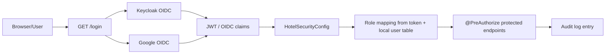
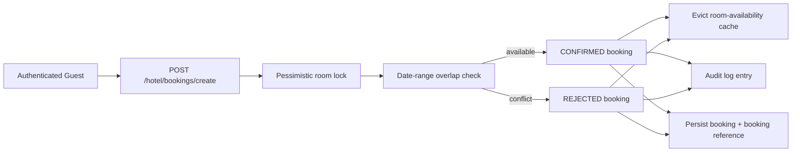
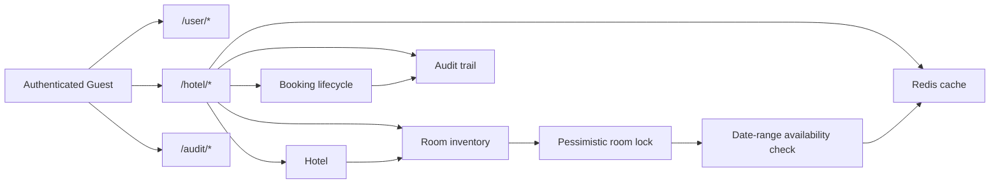

# Hotel Management API

Spring Boot REST API for managing hotels, rooms, bookings, and cached room availability with MySQL persistence, Redis caching, JWT authentication, and OAuth2 login support via Keycloak and Google.

## Overview

This release keeps the hotel-management workflow intact while refreshing the security layer, extending the domain model, and adding a persistent audit trail. The application supports Keycloak-backed JWT/resource-server access, Google OAuth2 login, Redis-backed room availability, and role-based endpoint protection through Spring Security annotations.

## Architecture

| Layer | Responsibility |
| --- | --- |
| API layer | Exposes hotel, room, user, and booking endpoints |
| Domain layer | Models hotels, rooms, users, and booking lifecycle states |
| Security layer | Uses JWT, OAuth2 login, and method-level authorization |
| Cache layer | Caches room-availability lookups in Redis and invalidates them on booking changes |
| Audit layer | Persists booking and security-sensitive actions in an audit log |
| Persistence layer | Stores hotel, room, user, and booking data in MySQL |
| View layer | Provides a Thymeleaf login page for browser sign-in |

## Concepts and Features Covered

- Spring Boot REST API setup
- Spring Data JPA repository pattern
- MySQL-backed persistence
- Spring Security with JWT resource-server support
- OAuth2 login with Keycloak
- OAuth2 login support for Google
- Method-level authorization with `@PreAuthorize`
- Public user registration and user listing
- Hotel creation, retrieval, listing, and deletion endpoints
- Room management for hotel inventory
- Booking creation with request/confirm/reject statuses
- Date-range validation for room availability
- Concurrency-safe booking writes using a locked room lookup
- Redis-backed caching for room availability searches
- Cache invalidation when rooms or bookings change
- Persistent audit logging for login, profile access, CRUD, and booking actions
- `/login` custom page backed by Thymeleaf
- Google user authority mapping from the local user table
- Global exception handling via `@RestControllerAdvice` for structured JSON error responses

## Tech Stack

- Java 17
- Spring Boot 3.3
- Spring Web
- Spring Data JPA
- Spring Security
- Spring Validation
- Spring OAuth2 Client
- Spring OAuth2 Resource Server
- Spring Cache
- Thymeleaf
- Redis
- MySQL
- Hibernate/JPA auditing patterns
- Maven
- Lombok
- JJWT

## Project Structure

```text
hotel/
├── CHANGELOG.md
├── README.md
├── pom.xml
├── mvnw
├── mvnw.cmd
└── src/
    └── main/
        ├── java/com/cn/hotelDemo/
        │   ├── config/
        │   ├── controller/
        │   ├── dto/
        │   ├── model/
        │   ├── repository/
        │   ├── service/
        │   └── HotelDemoApplication.java
        └── resources/
            ├── application.yml
            └── templates/
                └── login.html
```

## Environment Configuration

The application uses environment variables for sensitive or environment-specific settings. Create a `.env` file in the project root or export these variables before running the application:

* `DATASOURCE_URL`: The JDBC connection URL for MySQL (default: Azure MySQL database URI)
* `DATASOURCE_USERNAME`: The MySQL username (default: `demouser`)
* `DATASOURCE_PASSWORD`: The MySQL password (e.g. `Password~1234`)
* `KEYCLOAK_CLIENT_SECRET`: Keycloak client secret for OIDC registration
* `KEYCLOAK_ISSUER_URI`: Keycloak token issuer realm URI
* `KEYCLOAK_AUTH_SERVER_URL`: Keycloak authentication server endpoint URL
* `GOOGLE_CLIENT_ID`: Google OAuth client ID (optional)
* `GOOGLE_CLIENT_SECRET`: Google OAuth client secret (optional)
* `REDIS_HOST`: Redis server hostname (default: `localhost`)
* `REDIS_PORT`: Redis server port (default: `6379`)

See [.env.example](.env.example) for a complete template.

## How to Run

1. Open a terminal in the project root.
2. Copy `.env.example` to `.env` and configure your credentials and connection strings.
3. Run `mvn test` (executes the test suite against an isolated in-memory H2 database, requiring no active MySQL or Redis instances).
4. Run `mvn spring-boot:run`.
5. Open `http://localhost:8082/login` for the custom login page.
6. Use the API under `http://localhost:8082`.

Available endpoints:

- `GET /login`
- `GET /hotel/userDetail`
- `POST /hotel/create`
- `GET /hotel/id/{id}`
- `GET /hotel/getAll`
- `DELETE /hotel/remove/id/{id}`
- `POST /hotel/rooms/create`
- `GET /hotel/rooms/id/{id}`
- `GET /hotel/rooms/hotel/{hotelId}`
- `GET /hotel/rooms/hotel/{hotelId}/available?checkInDate=YYYY-MM-DD&checkOutDate=YYYY-MM-DD`
- `GET /hotel/rooms/getAll`
- `POST /hotel/bookings/create`
- `POST /hotel/bookings/cancel/{id}`
- `GET /hotel/bookings/id/{id}`
- `GET /hotel/bookings/getAll`
- `GET /hotel/bookings/user/{userId}`
- `GET /hotel/bookings/hotel/{hotelId}`
- `GET /audit/getAll`
- `GET /user/getUsers`
- `GET /user/getUsers/{id}`
- `POST /user/createUser`
- `DELETE /user/remove/id/{id}`

Access notes:

- `/login` is public.
- `GET /hotel/id/{id}` is for `NORMAL` users.
- `POST /hotel/create`, `GET /hotel/getAll`, and `DELETE /hotel/remove/id/{id}` are restricted to admin-style access.
- `POST /hotel/rooms/create` and `GET /hotel/rooms/getAll` are admin-only operations.
- `GET /audit/getAll` is admin-only.
- `GET /hotel/bookings/getAll` and `GET /hotel/bookings/hotel/{hotelId}` are admin-only operations.
- `POST /hotel/bookings/create` is available to authenticated hotel users.
- `GET /hotel/userDetail` uses the authenticated OIDC principal.
- Google login uses local user-role mapping from the MySQL user table.

Example user registration body:

```json
{
  "username": "john",
  "password": "john123",
  "email": "john@example.com",
  "role": "NORMAL"
}
```

Example hotel creation body:

```json
{
  "name": "Sea View Inn",
  "rating": 8,
  "city": "Goa"
}
```

Example room creation body:

```json
{
  "hotelId": 1,
  "roomNumber": "101",
  "roomType": "Deluxe",
  "capacity": 2,
  "nightlyRate": 4500.00,
  "status": "AVAILABLE"
}
```

Example room availability check:

`GET /hotel/rooms/hotel/1/available?checkInDate=2026-06-05&checkOutDate=2026-06-08`

Example booking creation body:

```json
{
  "hotelId": 1,
  "roomId": 1,
  "userId": 2,
  "checkInDate": "2026-06-05",
  "checkOutDate": "2026-06-08",
  "guestCount": 2,
  "specialRequests": "Late check-in"
}
```

Example booking response:

```json
{
  "bookingReference": "BOOK-1A2B3C4D",
  "status": "CONFIRMED",
  "message": "Booking confirmed successfully",
  "bookingId": 10
}
```

## Authentication Flow



## Booking Flow



## System Flow



## GitHub Metadata

- Suggested repository description: `Spring Boot REST API for hotel, room, booking, cached room-availability, and audit-log management with MySQL persistence, Redis caching, JWT authentication, and OAuth2 login support via Keycloak and Google.`
- Suggested topics: `java`, `java-17`, `spring-boot`, `spring-security`, `spring-data-jpa`, `spring-validation`, `spring-cache`, `redis`, `mysql`, `rest-api`, `hotel-management`, `room-booking`, `room-availability`, `cache-invalidation`, `audit-log`, `observability`, `concurrency`, `pessimistic-locking`, `jwt`, `oauth2`, `keycloak`, `google-login`, `thymeleaf`, `maven`, `learning-project`, `portfolio-project`
