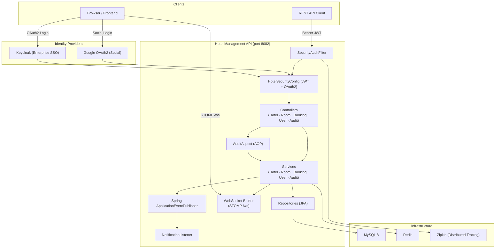
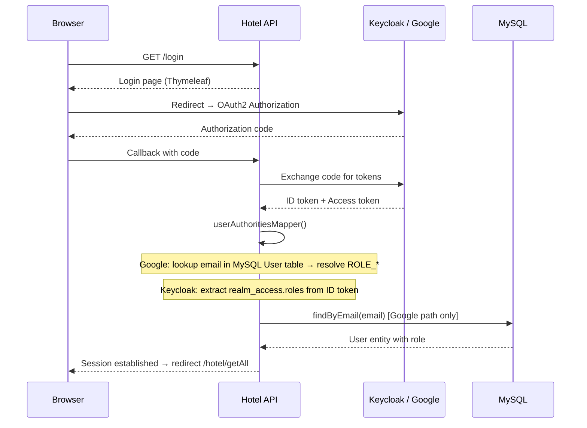
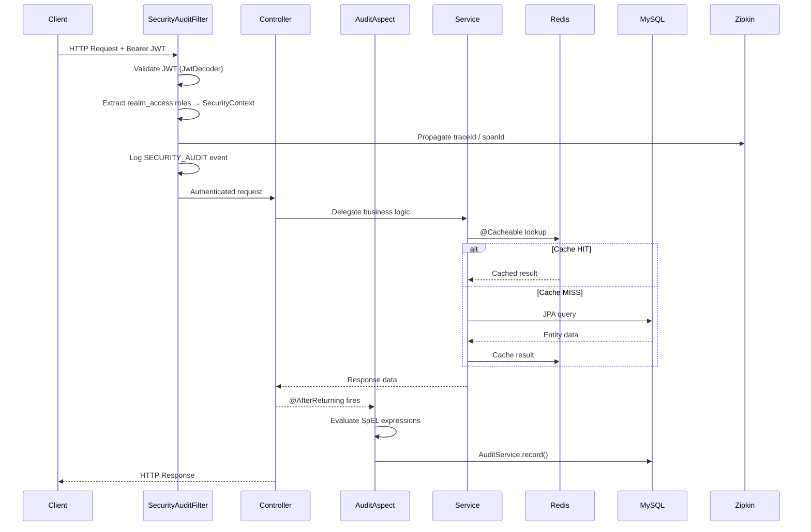
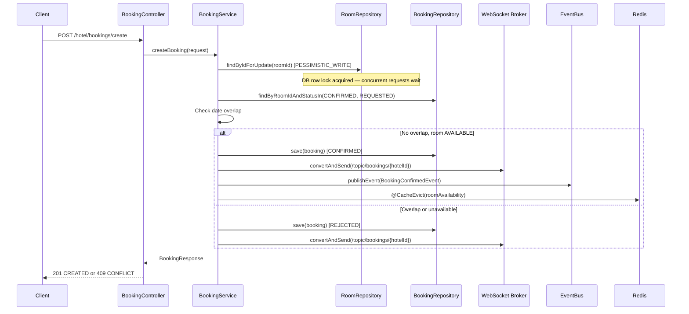
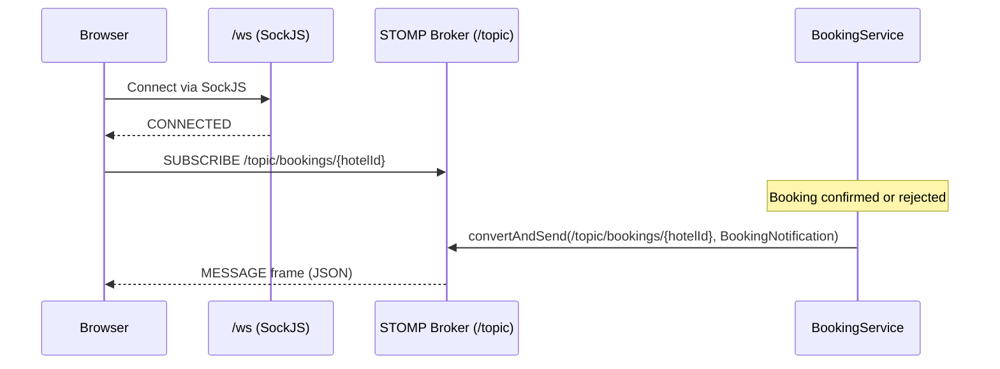
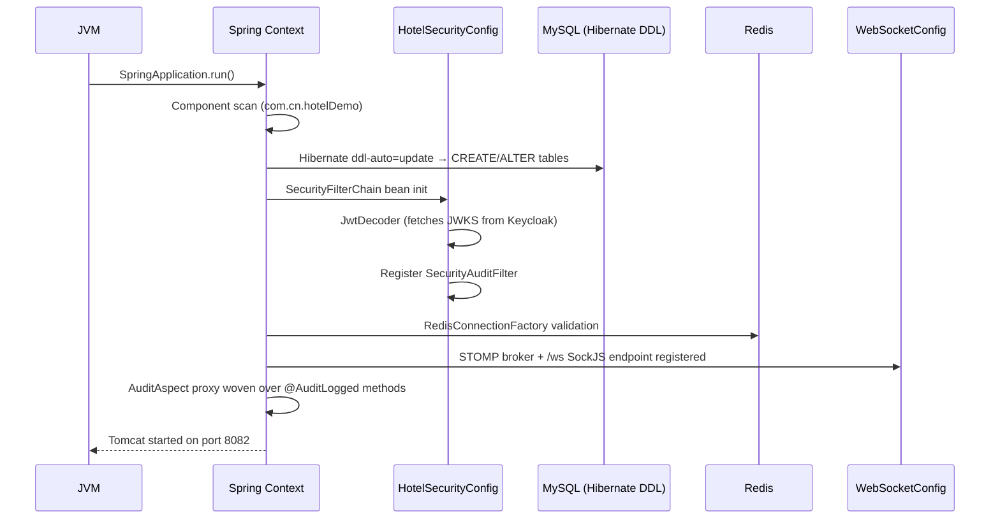
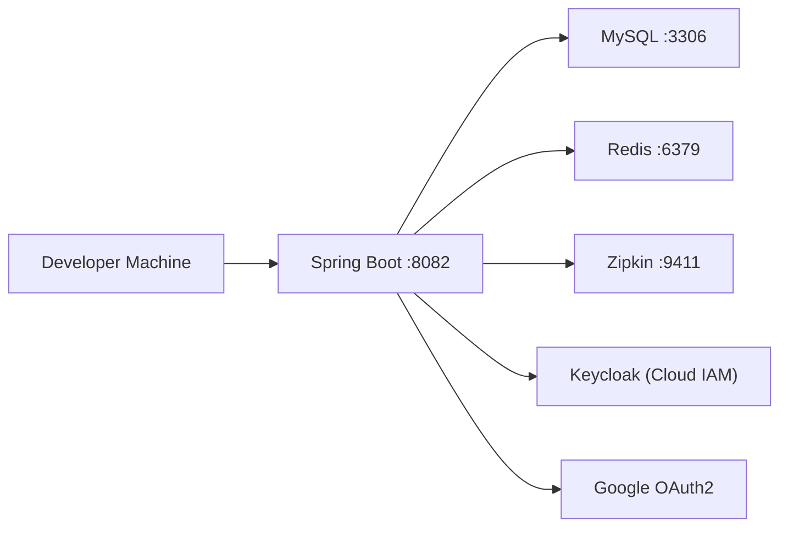
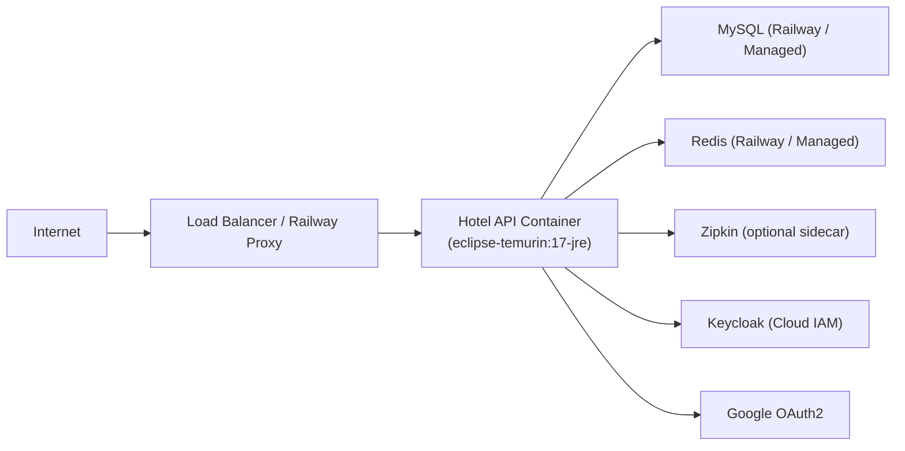

# Hotel Management API


A production-grade, cloud-ready hotel management backend built with **Spring Boot 3.3**, featuring dual OAuth2 identity providers (Keycloak + Google), pessimistic-locked concurrent bookings, Redis-backed room availability caching, STOMP WebSocket real-time notifications, AOP-driven audit logging, and distributed tracing via Micrometer + Zipkin.

---

## Table of Contents

- [Project Overview](#project-overview)
- [Tech Stack](#tech-stack)
- [High-Level Architecture](#high-level-architecture)
- [Request Flow](#request-flow)
- [Folder Structure](#folder-structure)
- [Component Responsibilities](#component-responsibilities)
- [Application Lifecycle](#application-lifecycle)
- [API Documentation](#api-documentation)
- [Security](#security)
- [Database](#database)
- [Cache](#cache)
- [WebSocket](#websocket)
- [Events & Notifications](#events--notifications)
- [Configuration](#configuration)
- [Build & Run](#build--run)
- [Testing](#testing)
- [Logging & Tracing](#logging--tracing)
- [Error Handling](#error-handling)
- [Design Patterns](#design-patterns)
- [Performance Optimizations](#performance-optimizations)
- [Scalability](#scalability)
- [CI/CD](#cicd)
- [Developer Guide](#developer-guide)
- [Troubleshooting](#troubleshooting)
- [Future Improvements](#future-improvements)

---

## Project Overview

### What problem does it solve?

Managing hotel bookings at scale requires solving three hard problems simultaneously:

1. **Concurrency** — Two guests must never book the same room for the same night. Without explicit locking, a race condition at the database level makes double-bookings possible even under moderate load.
2. **Authorization complexity** — A hotel admin managing inventory has different permissions than a guest booking a room or a system service reading audit logs. Role mapping must work across both enterprise SSO (Keycloak) and consumer social login (Google OAuth2).
3. **Operational visibility** — Every state change (booking created, cancelled, user elevated to admin) must be traceable for compliance and debugging without polluting business logic with logging boilerplate.

### Business Use Case

This API serves as the backend for a hotel-chain booking platform. It manages the **Hotel → Room → Booking** domain, enforces access control per-role, tracks every sensitive action in a persistent audit trail, and emits real-time booking status updates to connected browser clients via WebSocket so that front-desk dashboards update without polling.

### Major Features

| Feature | Implementation |
|---|---|
| Concurrent booking protection | `PESSIMISTIC_WRITE` lock on `room` row during `createBooking` |
| Dual identity providers | Keycloak (enterprise) + Google (social) via Spring OAuth2 |
| Redis-backed room availability | `@Cacheable` with a composite key (`hotelId:checkIn:checkOut`) |
| Real-time booking updates | STOMP WebSocket broadcast to `/topic/bookings/{hotelId}` |
| Declarative audit logging | `@AuditLogged` + AOP aspect with SpEL for dynamic resource IDs |
| Distributed tracing | Micrometer Tracing + Brave bridge + Zipkin reporter |
| Structured security audit log | `SecurityAuditFilter` logs every authenticated request with username, authorities, method, and URI |
| Global exception handling | `@ControllerAdvice` returns typed `ApiError` for all failure modes |
| Interactive API docs | SpringDoc OpenAPI / Swagger UI at `/swagger-ui.html` |

---

## Tech Stack

| Layer | Technology | Version |
|---|---|---|
| Language | Java | 17 |
| Framework | Spring Boot | 3.3.5 |
| Build Tool | Apache Maven | 3.x (via `mvnw`) |
| Persistence | Spring Data JPA + Hibernate | 6.5.x |
| Database | MySQL | 8 |
| Cache | Spring Data Redis | 3.x |
| Security | Spring Security + OAuth2 | 6.x |
| Identity Providers | Keycloak 15 + Google OAuth2 | — |
| JWT | Spring OAuth2 Resource Server (Nimbus) | — |
| WebSocket | Spring WebSocket + STOMP + SockJS | — |
| API Docs | SpringDoc OpenAPI | 2.6.0 |
| Tracing | Micrometer Tracing (Brave) + Zipkin | — |
| Observability | Spring Boot Actuator | — |
| AOP | Spring AOP (AspectJ) | — |
| Templating | Thymeleaf | — |
| Testing | JUnit 5 + Mockito + Testcontainers | 1.19.3 |
| Containerization | Docker (eclipse-temurin:17-jre) | — |
| Cloud Deployment | Railway | — |

---

## High-Level Architecture


```mermaid
graph TD
    subgraph Clients
        Browser["Browser / Frontend"]
        APIClient["REST API Client"]
    end

    subgraph Identity Providers
        Keycloak["Keycloak (Enterprise SSO)"]
        Google["Google OAuth2 (Social)"]
    end

    subgraph Hotel Management API ["Hotel Management API (port 8082)"]
        direction TB
        SecurityFilter["SecurityAuditFilter"]
        SecurityConfig["HotelSecurityConfig (JWT + OAuth2)"]
        Controllers["Controllers\n(Hotel · Room · Booking · User · Audit)"]
        AuditAspect["AuditAspect (AOP)"]
        Services["Services\n(Hotel · Room · Booking · User · Audit)"]
        EventPublisher["Spring ApplicationEventPublisher"]
        NotificationListener["NotificationListener"]
        WS["WebSocket Broker\n(STOMP /ws)"]
        Repos["Repositories (JPA)"]
    end

    subgraph Infrastructure
        MySQL["MySQL 8"]
        Redis["Redis"]
        Zipkin["Zipkin (Distributed Tracing)"]
    end

    Browser -- "OAuth2 Login" --> Keycloak
    Browser -- "Social Login" --> Google
    APIClient -- "Bearer JWT" --> SecurityFilter
    Browser -- "STOMP /ws" --> WS

    Keycloak --> SecurityConfig
    Google --> SecurityConfig
    SecurityFilter --> SecurityConfig
    SecurityConfig --> Controllers
    Controllers --> AuditAspect
    AuditAspect --> Services
    Controllers --> Services
    Services --> EventPublisher
    EventPublisher --> NotificationListener
    Services --> WS
    Services --> Repos
    Repos --> MySQL
    Services --> Redis
    SecurityFilter --> Zipkin
```

### Component Explanations

| Component | Role |
|---|---|
| **HotelSecurityConfig** | Configures the `SecurityFilterChain`. Handles OAuth2 login (Keycloak + Google), JWT resource server validation, role extraction from `realm_access` claims, and Google user role resolution from the MySQL `user` table. |
| **SecurityAuditFilter** | A `OncePerRequestFilter` that runs after authentication is established. Logs `SECURITY_AUDIT` events for every authenticated request — username, roles, HTTP method, and URI. |
| **Controllers** | Thin HTTP boundary layer. Validates requests, delegates to services, annotates methods with `@AuditLogged` for cross-cutting audit concerns. |
| **AuditAspect** | `@AfterReturning` AOP advice. Intercepts any method annotated with `@AuditLogged`, evaluates SpEL expressions for dynamic resource IDs and action names, and delegates to `AuditService`. |
| **Services** | All business logic lives here. `BookingService` is the most complex: it acquires a pessimistic lock, checks date overlaps, calculates pricing with hotel discounts, persists the booking, publishes a WebSocket notification, and fires a domain event. |
| **Spring Event Bus** | `ApplicationEventPublisher` decouples booking state changes from downstream concerns (e.g., email notifications). `NotificationListener` receives `BookingConfirmedEvent` and `BookingCancelledEvent`. |
| **WebSocket Broker** | In-memory STOMP broker. Clients subscribe to `/topic/bookings/{hotelId}` and receive `BookingNotification` messages in real time on booking creation or rejection. |
| **Repositories** | Standard Spring Data JPA repositories. `RoomRepository` adds a `@Lock(PESSIMISTIC_WRITE)` custom query for booking-time row locking. |
| **Redis** | Caches room availability search results keyed by `hotelId:checkIn:checkOut`. TTL is 10 minutes. Cache is evicted on room creation, booking creation, and booking cancellation. |
| **Zipkin** | Receives 100% sampled traces (configurable). Trace IDs and span IDs are propagated in log output via the MDC pattern. |

---

## Request Flow

### OAuth2 / Social Login Flow


```mermaid
sequenceDiagram
    participant Browser
    participant App as Hotel API
    participant IDP as Keycloak / Google
    participant MySQL

    Browser->>App: GET /login
    App-->>Browser: Login page (Thymeleaf)
    Browser->>IDP: Redirect → OAuth2 Authorization
    IDP-->>Browser: Authorization code
    Browser->>App: Callback with code
    App->>IDP: Exchange code for tokens
    IDP-->>App: ID token + Access token
    App->>App: userAuthoritiesMapper()
    Note over App: Google: lookup email in MySQL User table → resolve ROLE_*
    Note over App: Keycloak: extract realm_access.roles from ID token
    App->>MySQL: findByEmail(email) [Google path only]
    MySQL-->>App: User entity with role
    App-->>Browser: Session established → redirect /hotel/getAll
```

### Authenticated REST API Flow


```mermaid
sequenceDiagram
    participant Client
    participant Filter as SecurityAuditFilter
    participant Controller
    participant Aspect as AuditAspect
    participant Service
    participant Redis
    participant MySQL
    participant Zipkin

    Client->>Filter: HTTP Request + Bearer JWT
    Filter->>Filter: Validate JWT (JwtDecoder)
    Filter->>Filter: Extract realm_access roles → SecurityContext
    Filter->>Zipkin: Propagate traceId / spanId
    Filter->>Filter: Log SECURITY_AUDIT event
    Filter->>Controller: Authenticated request
    Controller->>Service: Delegate business logic
    Service->>Redis: @Cacheable lookup
    alt Cache HIT
        Redis-->>Service: Cached result
    else Cache MISS
        Service->>MySQL: JPA query
        MySQL-->>Service: Entity data
        Service->>Redis: Cache result
    end
    Service-->>Controller: Response data
    Controller-->>Aspect: @AfterReturning fires
    Aspect->>Aspect: Evaluate SpEL expressions
    Aspect->>MySQL: AuditService.record()
    Controller-->>Client: HTTP Response
```

### Booking Creation Flow (Pessimistic Locking)


```mermaid
sequenceDiagram
    participant Client
    participant BookingController
    participant BookingService
    participant RoomRepo as RoomRepository
    participant BookingRepo as BookingRepository
    participant WS as WebSocket Broker
    participant EventBus

    Client->>BookingController: POST /hotel/bookings/create
    BookingController->>BookingService: createBooking(request)
    BookingService->>RoomRepo: findByIdForUpdate(roomId) [PESSIMISTIC_WRITE]
    Note over RoomRepo: DB row lock acquired — concurrent requests wait
    BookingService->>BookingRepo: findByRoomIdAndStatusIn(CONFIRMED, REQUESTED)
    BookingService->>BookingService: Check date overlap
    alt No overlap, room AVAILABLE
        BookingService->>BookingRepo: save(booking) [CONFIRMED]
        BookingService->>WS: convertAndSend(/topic/bookings/{hotelId})
        BookingService->>EventBus: publishEvent(BookingConfirmedEvent)
        BookingService->>Redis: @CacheEvict(roomAvailability)
    else Overlap or unavailable
        BookingService->>BookingRepo: save(booking) [REJECTED]
        BookingService->>WS: convertAndSend(/topic/bookings/{hotelId})
    end
    BookingService-->>BookingController: BookingResponse
    BookingController-->>Client: 201 CREATED or 409 CONFLICT
```

### WebSocket Subscription Flow


```mermaid
sequenceDiagram
    participant Browser
    participant WSEndpoint as /ws (SockJS)
    participant Broker as STOMP Broker (/topic)
    participant Service as BookingService

    Browser->>WSEndpoint: Connect via SockJS
    WSEndpoint-->>Browser: CONNECTED
    Browser->>Broker: SUBSCRIBE /topic/bookings/{hotelId}
    Note over Service: Booking confirmed or rejected
    Service->>Broker: convertAndSend(/topic/bookings/{hotelId}, BookingNotification)
    Broker-->>Browser: MESSAGE frame (JSON)
```

---

## Folder Structure

```
hotel-management-api/
├── .github/
│   └── workflows/
│       └── ci.yml                  # GitHub Actions: build + verify on every push
├── scripts/
│   └── load-test.sh                # Apache Bench load test against /hotel/getAll
├── src/
│   ├── main/
│   │   ├── java/com/cn/hotelDemo/
│   │   │   ├── HotelDemoApplication.java   # Entry point
│   │   │   ├── annotation/                 # Custom annotations (@AuditLogged)
│   │   │   ├── aspect/                     # AOP aspects (AuditAspect)
│   │   │   ├── config/                     # Spring configuration beans
│   │   │   │   ├── HotelSecurityConfig     # Security filter chain, JWT, OAuth2 roles
│   │   │   │   ├── WebSocketConfig         # STOMP broker, endpoints
│   │   │   │   ├── OpenApiConfig           # Swagger/OpenAPI definitions
│   │   │   │   └── PasswordEncoderConfig   # BCrypt bean
│   │   │   ├── controller/                 # REST controllers (HTTP boundary)
│   │   │   ├── dto/                        # Request/Response transfer objects
│   │   │   ├── event/                      # Domain events + listeners
│   │   │   │   ├── BookingConfirmedEvent
│   │   │   │   ├── BookingCancelledEvent
│   │   │   │   └── NotificationListener
│   │   │   ├── exception/                  # Custom exceptions + GlobalExceptionHandler
│   │   │   ├── filter/                     # Servlet filters (SecurityAuditFilter)
│   │   │   ├── model/                      # JPA entities + enums
│   │   │   ├── repository/                 # Spring Data JPA repositories
│   │   │   └── service/                    # Business logic layer
│   │   └── resources/
│   │       └── application.yml             # All runtime configuration
│   └── test/
│       └── java/com/cn/hotelDemo/
│           ├── config/                     # Security config unit tests
│           ├── controller/                 # Security integration tests (MockMvc)
│           ├── integration/                # E2E Testcontainers tests
│           └── service/                    # Service-layer unit tests (Mockito)
├── Dockerfile
├── docker-compose.yml              # Zipkin only (app + MySQL external)
├── .env.example                    # All required environment variables
├── pom.xml
└── railway.json                    # Railway cloud deployment configuration
```

---

## Component Responsibilities

### Controllers

Controllers are thin HTTP boundary layers. They:
- Accept and validate `@RequestBody` DTOs via `@Valid`
- Enforce method-level security via `@PreAuthorize`
- Annotate with `@AuditLogged` for declarative audit trail
- Delegate all logic to services

| Controller | Base Path | Responsibility |
|---|---|---|
| `HotelController` | `/hotel` | CRUD for hotels; OIDC user profile |
| `RoomController` | `/hotel/rooms` | Create rooms; query by hotel; availability search |
| `BookingController` | `/hotel/bookings` | Create, view, cancel bookings |
| `UserController` | `/user` | User CRUD with BCrypt password hashing |
| `AuditController` | `/audit` | Admin-only read of the audit log |
| `LoginController` | `/login` | Renders the Thymeleaf login page |

### Services

Services contain all business logic and transaction boundaries:

| Service | Key Responsibilities |
|---|---|
| `BookingService` | Pessimistic lock acquisition, date-overlap detection, price calculation with hotel discount, WebSocket notification, event publishing, cache eviction |
| `RoomService` | Room creation (cache evict), date-aware availability query (cacheable), room lookup |
| `HotelService` | Hotel CRUD |
| `UserService` | User CRUD, BCrypt password encoding |
| `AuditService` | Persists `AuditLog` records transactionally |

### Repositories

| Repository | Notable Queries |
|---|---|
| `BookingRepository` | `findByRoomIdAndStatusIn`, `findByHotelIdAndStatusIn`, `findByUserId`, `findByHotelId` |
| `RoomRepository` | `findByHotelId`, `findByIdForUpdate` (`@Lock(PESSIMISTIC_WRITE)`) |
| `HotelRepository` | Standard CRUD |
| `UserRepository` | `findByEmail` (used by Google OIDC role resolution) |
| `AuditLogRepository` | Standard CRUD |

### DTOs

| DTO | Direction | Purpose |
|---|---|---|
| `BookingRequest` | Inbound | userId, roomId, hotelId, checkIn/checkOut dates, guestCount, specialRequests |
| `BookingResponse` | Outbound | bookingReference, status, message, bookingId, totalPrice |
| `BookingNotification` | WebSocket | bookingReference, status, message, hotelId, roomId |
| `RoomRequest` | Inbound | hotelId, roomNumber, roomType, capacity, nightlyRate, status |

### Configurations

| Config Class | Purpose |
|---|---|
| `HotelSecurityConfig` | `SecurityFilterChain`, JWT converter, OIDC role mapper, `JwtDecoder`, `SecurityAuditFilter` injection |
| `WebSocketConfig` | STOMP endpoint `/ws` (SockJS), simple broker on `/topic`, app prefix `/app` |
| `OpenApiConfig` | Global OpenAPI metadata, Bearer Auth security scheme for Swagger UI |
| `PasswordEncoderConfig` | `BCryptPasswordEncoder` bean |

### Filters

**`SecurityAuditFilter`** (`OncePerRequestFilter`) — Runs after `UsernamePasswordAuthenticationFilter`. If the request is authenticated (not `anonymousUser`), emits a structured `SECURITY_AUDIT` log line containing the username, granted authorities, HTTP method, and request URI.

### Exception Handlers

**`GlobalExceptionHandler`** (`@ControllerAdvice`) — Catches all exception types and maps them to `ApiError` response bodies:

| Exception | HTTP Status |
|---|---|
| `HotelNotFoundException` | 404 Not Found |
| `UserNotFoundException` | 404 Not Found |
| `RoomNotFoundException` | 404 Not Found |
| `BookingNotFoundException` | 404 Not Found |
| `IllegalArgumentException` | 400 Bad Request |
| `MethodArgumentNotValidException` | 400 Bad Request (field-level messages) |
| `AccessDeniedException` | 403 Forbidden |
| `Exception` (catch-all) | 500 Internal Server Error |

### AOP Aspect

**`AuditAspect`** — `@AfterReturning` advice on any method annotated with `@AuditLogged`. It:
1. Resolves the current user from `SecurityContextHolder`
2. Evaluates the `resourceIdSpel` and optionally `action` SpEL expressions against method arguments and the return value
3. Calls `AuditService.record()` with the resolved values

---

## Application Lifecycle


```mermaid
sequenceDiagram
    participant JVM
    participant Spring as Spring Context
    participant Security as HotelSecurityConfig
    participant DB as MySQL (Hibernate DDL)
    participant Redis
    participant WS as WebSocketConfig

    JVM->>Spring: SpringApplication.run()
    Spring->>Spring: Component scan (com.cn.hotelDemo)
    Spring->>DB: Hibernate ddl-auto=update → CREATE/ALTER tables
    Spring->>Security: SecurityFilterChain bean init
    Security->>Security: JwtDecoder (fetches JWKS from Keycloak)
    Security->>Security: Register SecurityAuditFilter
    Spring->>Redis: RedisConnectionFactory validation
    Spring->>WS: STOMP broker + /ws SockJS endpoint registered
    Spring->>Spring: AuditAspect proxy woven over @AuditLogged methods
    Spring-->>JVM: Tomcat started on port 8082
```

**Database initialization:** Hibernate `ddl-auto: update` runs at startup. It compares the entity model to the existing schema and issues `CREATE TABLE` or `ALTER TABLE` as needed — safe for iterative development but should be replaced with Flyway/Liquibase for production.

**Security initialization:** `JwtDecoder` fetches the JSON Web Key Set (JWKS) from the Keycloak issuer URI at startup to validate RS256-signed access tokens.

---

## API Documentation

Interactive documentation is available at `http://localhost:8082/swagger-ui.html`. The full OpenAPI spec is at `/v3/api-docs`.

### Hotels

| Method | URL | Purpose | Auth |
|---|---|---|---|
| `GET` | `/hotel/userDetail` | Current user's OIDC profile | Any role |
| `POST` | `/hotel/create` | Create a new hotel | `ADMIN` |
| `GET` | `/hotel/id/{id}` | Get hotel by ID | Any role |
| `GET` | `/hotel/getAll` | List all hotels | `ADMIN` |
| `DELETE` | `/hotel/remove/id/{id}` | Delete a hotel | `ADMIN` |

### Rooms

| Method | URL | Purpose | Auth |
|---|---|---|---|
| `POST` | `/hotel/rooms/create` | Add a room to a hotel | `ADMIN` |
| `GET` | `/hotel/rooms/hotel/{hotelId}` | All rooms for a hotel | Any role |
| `GET` | `/hotel/rooms/hotel/{hotelId}/available?checkInDate=&checkOutDate=` | Date-aware availability (cached) | Any role |
| `GET` | `/hotel/rooms/id/{id}` | Get room by ID | Any role |
| `GET` | `/hotel/rooms/getAll` | All rooms (all hotels) | `ADMIN` |

### Bookings

| Method | URL | Purpose | Auth |
|---|---|---|---|
| `POST` | `/hotel/bookings/create` | Create a booking | Any role |
| `GET` | `/hotel/bookings/id/{id}` | Get booking by ID | Any role |
| `GET` | `/hotel/bookings/getAll` | All bookings | `ADMIN` |
| `GET` | `/hotel/bookings/user/{userId}` | Bookings for a user | Any role |
| `GET` | `/hotel/bookings/hotel/{hotelId}` | Bookings for a hotel | `ADMIN` |
| `POST` | `/hotel/bookings/cancel/{id}` | Cancel a booking | Owner or `ADMIN` |

### Users

| Method | URL | Purpose | Auth |
|---|---|---|---|
| `GET` | `/user/getUsers` | List all users | Any role |
| `GET` | `/user/getUsers/{id}` | Get user by ID | Any role |
| `POST` | `/user/createUser` | Register a new user | Public |
| `DELETE` | `/user/remove/id/{id}` | Delete a user | Any role |

### Audit

| Method | URL | Purpose | Auth |
|---|---|---|---|
| `GET` | `/audit/getAll` | Retrieve all audit logs | `ADMIN` |

### Public / System

| Method | URL | Purpose | Auth |
|---|---|---|---|
| `GET` | `/login` | OAuth2 login page | Public |
| `GET` | `/swagger-ui.html` | API documentation | Public |
| `GET` | `/v3/api-docs/**` | OpenAPI spec | Public |
| `GET` | `/actuator/health` | Health check | Public |
| `GET` | `/actuator/metrics` | Metrics | Public |
| `GET` | `/actuator/prometheus` | Prometheus scrape | Public |
| `WS` | `/ws` | STOMP WebSocket endpoint (SockJS) | Public |

---

## Security

### Authentication

The API supports two authentication mechanisms:

**1. JWT Bearer Token (REST API clients)**
Clients send `Authorization: Bearer <access_token>` in the HTTP header. The `JwtDecoder` bean validates the token signature against the Keycloak JWKS endpoint. Role extraction is performed by a custom `JwtAuthenticationConverter` that reads the `realm_access.roles` array from the JWT claims.

**2. OAuth2 Authorization Code Flow (Browser clients)**
Users are redirected to Keycloak or Google for authentication. On callback, the `userAuthoritiesMapper` bean resolves granted authorities:
- **Keycloak path:** Roles come directly from `realm_access.roles` in the ID token.
- **Google path:** The user's email is looked up in the MySQL `user` table. The `role` column in that record determines the `ROLE_*` granted authority. This allows assigning roles to Google users via the application's own database.

### Authorization

Method-level authorization is enforced via `@PreAuthorize` annotations:

```java
// Admin-only
@PreAuthorize("hasRole('ADMIN') or hasAuthority('admin')")

// Any authenticated user
@PreAuthorize("hasRole('ADMIN') or hasAuthority('admin') or hasRole('NORMAL') or hasAuthority('normal')")
```

Owner-based authorization (e.g., cancelling your own booking) is implemented programmatically in `BookingController.cancelBooking()` by comparing the authenticated principal's name/email against the booking owner.

### Security Rules Summary

| Path | Rule |
|---|---|
| `/login`, `/swagger-ui/**`, `/v3/api-docs/**`, `/ws`, `/ws/**`, `/ws-test.html` | `permitAll` |
| All other paths | `authenticated` |
| `GET /hotel/getAll`, `DELETE /hotel/remove/**`, `POST /hotel/create` | `ROLE_ADMIN` |
| `GET /audit/getAll` | `ROLE_ADMIN` |
| `POST /hotel/bookings/cancel/{id}` | Booking owner or `ROLE_ADMIN` |

### Password Encoding

User passwords stored in the `user` table are hashed with `BCryptPasswordEncoder` (strength 10 by default). Plaintext passwords are never persisted.

### CSRF

CSRF protection is not explicitly configured, which means Spring Security's default CSRF behavior applies. For stateless JWT REST APIs, CSRF is typically disabled — *inferred from implementation: a `csrf().disable()` call is absent, but the resource server path operates statelessly via `Authorization` header, making CSRF moot for that path. The OAuth2 login flow relies on session cookies, so review CSRF posture if the frontend is not served from the same origin.*

### CORS

No explicit CORS configuration was found in `HotelSecurityConfig`. WebSocket SockJS allows `allowedOriginPatterns("*")`. For production, add `http.cors()` with a `CorsConfigurationSource` bean.

---

## Database

### Schema (Inferred from JPA entities, `ddl-auto: update`)

```
hotel
├── id             BIGINT PK AUTO_INCREMENT
├── name           VARCHAR
├── city           VARCHAR
├── rating         (field type inferred: numeric)
└── discount       (field type inferred: numeric, used in price calculation)

room
├── id             BIGINT PK AUTO_INCREMENT
├── hotel_id       BIGINT FK → hotel.id
├── room_number    VARCHAR
├── room_type      VARCHAR
├── capacity       INT
├── nightly_rate   DECIMAL
└── status         VARCHAR (AVAILABLE | BOOKED | MAINTENANCE)

booking
├── id                BIGINT PK AUTO_INCREMENT
├── booking_reference VARCHAR UNIQUE NOT NULL
├── hotel_id          BIGINT FK → hotel.id
├── room_id           BIGINT FK → room.id
├── user_id           BIGINT FK → user.id
├── check_in_date     DATE
├── check_out_date    DATE
├── guest_count       INT
├── special_requests  VARCHAR
├── total_price       DECIMAL(precision=2)
└── status            VARCHAR (REQUESTED | CONFIRMED | CANCELLED | REJECTED)

user
├── id         BIGINT PK AUTO_INCREMENT
├── username   VARCHAR
├── email      VARCHAR
├── password   VARCHAR (BCrypt)
└── role       VARCHAR

audit_log
├── id            BIGINT PK AUTO_INCREMENT
├── action        VARCHAR
├── actor         VARCHAR
├── resource_type VARCHAR
├── resource_id   VARCHAR
├── status        VARCHAR
└── message       VARCHAR
```

### Relationships

```
hotel ──< room ──< booking >── user
                  booking >── hotel
```

- `Hotel` → `Room`: One-to-many (`@OneToMany`)
- `Room` → `Booking`: One-to-many (`@OneToMany`)
- `Booking` → `User`, `Room`, `Hotel`: Many-to-one (`@ManyToOne`)

### Transactions

- `BookingService.createBooking()` — `@Transactional`. Acquires pessimistic write lock on `room`, checks overlaps, persists booking, evicts cache — all within one transaction. Lock is released on commit.
- `BookingService.cancelBooking()` — `@Transactional`. Updates booking status, evicts cache.
- `RoomService.createRoom()` — `@Transactional`. Creates room, updates hotel's room list.
- `RoomService.getAvailableRoomsByHotelAndDates()` — `@Transactional(readOnly = true)`.
- `AuditService.record()` — `@Transactional`. Persists audit log entry.

### Pessimistic Locking

`RoomRepository.findByIdForUpdate()` is annotated with `@Lock(LockModeType.PESSIMISTIC_WRITE)`, which issues a `SELECT ... FOR UPDATE` statement. This prevents two concurrent booking requests for the same room from both passing the availability check.

---

## Cache

### Provider

**Redis** — configured via `spring.cache.type: redis` with a 10-minute TTL (`spring.cache.redis.time-to-live: 10m`).

### Cached Operations

| Cache Name | Key | Populated By | Evicted By |
|---|---|---|---|
| `roomAvailability` | `{hotelId}:{checkInDate}:{checkOutDate}` | `RoomService.getAvailableRoomsByHotelAndDates()` | `RoomService.createRoom()`, `BookingService.createBooking()`, `BookingService.cancelBooking()` |

### Cache Strategy

- **Read-through:** `@Cacheable` checks Redis on every `GET /hotel/rooms/{hotelId}/available` call. A cache hit avoids the JPA query entirely.
- **Write-invalidate:** On any state change that could affect availability (new room, new booking, cancelled booking), `@CacheEvict(allEntries = true)` purges all keys in `roomAvailability`. This is intentionally aggressive to avoid stale reads.

### Performance Benefit

Room availability searches involve a join across `room` and `booking` with date range filtering. Caching avoids this query for repeated requests within the 10-minute window — particularly impactful for front-desk dashboards that poll frequently.

---

## WebSocket

### Configuration

```yaml
Endpoint:     /ws (SockJS fallback enabled)
Broker:       Simple in-memory STOMP broker
Subscribe:    /topic/**
Send prefix:  /app (for @MessageMapping handlers, none currently defined)
CORS:         allowedOriginPatterns("*")
```

### Connection Lifecycle

1. Client connects to `/ws` using SockJS (falls back to HTTP long-polling if WebSocket is unavailable).
2. Client sends `SUBSCRIBE /topic/bookings/{hotelId}`.
3. On booking creation or rejection, `BookingService` calls `messagingTemplate.convertAndSend("/topic/bookings/{hotelId}", notification)`.
4. All subscribers to that topic receive the `BookingNotification` as a JSON-serialized STOMP message frame.

### Message Payload (`BookingNotification`)

```json
{
  "bookingReference": "BOOK-1F8BFA67",
  "status": "CONFIRMED",
  "message": "Booking confirmed successfully",
  "hotelId": 1,
  "roomId": 5
}
```

### Reconnect Strategy

SockJS handles reconnection transparently on the client side. The server-side broker is in-memory and stateless — subscriptions are lost on reconnect and clients must re-subscribe.

---

## Events & Notifications

The application uses Spring's `ApplicationEventPublisher` to decouple booking state changes from downstream notification concerns.

| Event | Publisher | Listener | Trigger |
|---|---|---|---|
| `BookingConfirmedEvent` | `BookingService.createBooking()` | `NotificationListener` | When a booking is confirmed |
| `BookingCancelledEvent` | `BookingService.cancelBooking()` | `NotificationListener` | When a booking is cancelled |

**Current implementation:** `NotificationListener` is a stub that logs the notification intent. In production, replace with real email, SMS, or push notification delivery.

---

## Configuration

### `application.yml` — All Properties

| Property | Default | Purpose |
|---|---|---|
| `spring.application.name` | `hotelDemo` | Appears in Micrometer trace logs |
| `spring.datasource.url` | `${DB_URL}` | MySQL JDBC connection URL |
| `spring.datasource.username` | `${DB_USERNAME}` | Database user |
| `spring.datasource.password` | `${DB_PASSWORD}` | Database password |
| `spring.jpa.hibernate.ddl-auto` | `update` | Schema management mode |
| `spring.jpa.show-sql` | `true` | Prints SQL to stdout (disable in prod) |
| `spring.cache.type` | `redis` | Cache provider |
| `spring.cache.redis.time-to-live` | `10m` | Global cache TTL |
| `spring.data.redis.host` | `${REDIS_HOST:localhost}` | Redis hostname |
| `spring.data.redis.port` | `${REDIS_PORT:6379}` | Redis port |
| `spring.security.oauth2.client.registration.keycloak.*` | See below | Keycloak OAuth2 client config |
| `spring.security.oauth2.client.registration.google.*` | See below | Google OAuth2 client config |
| `keycloak.auth-server-url` | `${KEYCLOAK_AUTH_SERVER_URL}` | Keycloak base URL (legacy adapter) |
| `keycloak.realm` | `hotel-demo` | Keycloak realm name |
| `app.security.enabled` | `true` | Toggle security (`@ConditionalOnProperty`) |
| `app.security.jwt-issuer-uri` | `${JWT_ISSUER_URI}` | JWKS discovery endpoint |
| `server.port` | `8082` | HTTP server port |
| `management.tracing.sampling.probability` | `1.0` | 100% trace sampling |
| `management.zipkin.tracing.endpoint` | `http://localhost:9411/api/v2/spans` | Zipkin collector |
| `management.endpoints.web.exposure.include` | `health,metrics,prometheus` | Exposed Actuator endpoints |

### Required Environment Variables

Copy `.env.example` to `.env` and populate:

```bash
# Database
DB_URL=jdbc:mysql://localhost:3306/hotel
DB_USERNAME=demouser
DB_PASSWORD=<your-password>

# Redis
REDIS_HOST=localhost
REDIS_PORT=6379

# Keycloak
KEYCLOAK_CLIENT_ID=hotelDemoApplication
KEYCLOAK_CLIENT_SECRET=<your-secret>
KEYCLOAK_AUTH_SERVER_URL=https://<your-keycloak>/auth
JWT_ISSUER_URI=https://<your-keycloak>/auth/realms/hotel-demo

# Google OAuth2
GOOGLE_CLIENT_ID=<your-google-client-id>
GOOGLE_CLIENT_SECRET=<your-google-secret>
```

---

## Build & Run

### Prerequisites

- Java 17+
- Maven 3.6+ (or use the bundled `./mvnw`)
- MySQL 8
- Redis 6+
- Docker (optional)

### Clone

```bash
git clone https://github.com/byte2code/hotel-management-api.git
cd hotel-management-api
```

### Build

```bash
./mvnw clean package -DskipTests
```

### Run Tests

```bash
# Unit + integration tests (Testcontainers spins up MySQL + Redis automatically)
./mvnw clean verify
```

### Run Locally

```bash
# Export required environment variables first
export DB_URL=jdbc:mysql://localhost:3306/hotel
export DB_USERNAME=root
export DB_PASSWORD=secret
export REDIS_HOST=localhost
export JWT_ISSUER_URI=https://...

./mvnw spring-boot:run
# App available at http://localhost:8082
# Swagger UI: http://localhost:8082/swagger-ui.html
```

### Docker

```bash
# Build image
docker build -t hotel-management-api .

# Run container
docker run -p 8082:8082 \
  -e DB_URL=jdbc:mysql://host.docker.internal:3306/hotel \
  -e DB_USERNAME=root \
  -e DB_PASSWORD=secret \
  -e REDIS_HOST=host.docker.internal \
  -e JWT_ISSUER_URI=https://... \
  -e KEYCLOAK_CLIENT_SECRET=... \
  -e GOOGLE_CLIENT_ID=... \
  -e GOOGLE_CLIENT_SECRET=... \
  hotel-management-api
```

### Docker Compose (Zipkin)

The included `docker-compose.yml` starts Zipkin:

```bash
docker compose up -d
# Zipkin UI: http://localhost:9411
```

### Load Test

```bash
# Requires Apache Bench (ab)
bash scripts/load-test.sh
```

---

## Testing

### Test Architecture

```
src/test/java/com/cn/hotelDemo/
├── config/
│   └── HotelSecurityConfigTest       # Unit: JWT converter & OIDC role mapper
├── controller/
│   └── SecurityIntegrationTest       # Integration: RBAC rules via MockMvc
├── integration/
│   ├── BaseIntegrationTest           # Testcontainers: MySQL + Redis setup
│   ├── HotelIntegrationTest          # E2E: Hotel creation flow
│   └── BookingFlowIntegrationTest    # E2E: Full booking lifecycle + audit
└── service/
    ├── AuditServiceTest              # Unit: AuditService.record()
    ├── BookingServiceTest            # Unit: createBooking + cancelBooking
    └── RoomServiceTest               # Unit: @Cacheable / @CacheEvict
```

### Test Types

**Unit Tests** (`service/`, `config/`) — Use Mockito to mock repositories and Spring beans. Test business logic in isolation. Fast — no containers required.

**Security Unit Tests** (`HotelSecurityConfigTest`) — Use `@WebMvcTest` with `@WithMockUser` to test HTTP-level RBAC rules and the JWT/OIDC authority mapping logic without a running identity provider.

**Integration Tests** (`integration/`) — Use Testcontainers to spin up real MySQL and Redis containers. `BaseIntegrationTest` handles container lifecycle. Tests use `MockMvc` + `@SpringBootTest(webEnvironment = RANDOM_PORT)` to exercise the full Spring context.

### Running Tests

```bash
# All tests (requires Docker for Testcontainers)
./mvnw clean verify

# Unit tests only (no Docker needed)
./mvnw test -Dtest="AuditServiceTest,BookingServiceTest,RoomServiceTest,HotelSecurityConfigTest"
```

### Test Coverage

Key scenarios covered:

| Scenario | Test Class |
|---|---|
| `createBooking` — confirmed path | `BookingFlowIntegrationTest` |
| `createBooking` — date overlap rejected | `BookingServiceTest` |
| `cancelBooking` — only CONFIRMED bookings | `BookingServiceTest` |
| Room cache hit/miss/evict | `RoomServiceTest` |
| JWT `realm_access` role extraction | `HotelSecurityConfigTest` |
| Google OIDC → DB role resolution | `HotelSecurityConfigTest` |
| Admin-only endpoints return 403 for NORMAL | `SecurityIntegrationTest` |
| Public endpoints are accessible without auth | `SecurityIntegrationTest` |

---

## Logging & Tracing

### Framework

SLF4J + Logback (Spring Boot default).

### Log Pattern

```
%5p [${spring.application.name},%X{traceId:-},%X{spanId:-}]
```

Every log line includes the **application name**, **Micrometer trace ID**, and **span ID** — enabling correlation of all log lines within a single HTTP request or WebSocket message.

### Trace IDs in Response

Micrometer Tracing with Brave bridge propagates W3C `traceparent` headers. Zipkin receives spans at `http://localhost:9411/api/v2/spans`.

### Security Audit Log

`SecurityAuditFilter` emits `SECURITY_AUDIT` structured log lines on every authenticated request:

```
INFO  SecurityAuditFilter : SECURITY_AUDIT: User 'alice' with authorities '[ROLE_ADMIN]' accessed POST /hotel/bookings/create
```

### Business Audit Log

`AuditService` writes records to the `audit_log` database table:

```
INFO  AuditService : AUDIT action=BOOKING_CONFIRMED actor=alice resourceType=BOOKING resourceId=42 status=SUCCESS
```

---

## Error Handling

All errors return a structured `ApiError` JSON body:

```json
{
  "timestamp": "2026-07-18T10:00:00",
  "status": 404,
  "error": "Not Found",
  "message": "Booking not found with ID: 99",
  "path": "/hotel/bookings/id/99"
}
```

### Exception Hierarchy

```
Exception
├── HotelNotFoundException      → 404
├── UserNotFoundException        → 404
├── RoomNotFoundException        → 404
├── BookingNotFoundException     → 404
├── IllegalArgumentException     → 400 (validation logic, bad dates, etc.)
├── MethodArgumentNotValidException → 400 (Bean Validation, field-level messages)
├── AccessDeniedException        → 403
└── Exception (catch-all)        → 500 (message hidden from caller)
```

---

## Design Patterns

| Pattern | Where Applied |
|---|---|
| **Repository** | All JPA repositories extend `JpaRepository` — data access abstracted from business logic |
| **Service Layer (Facade)** | Services encapsulate all business rules and transaction boundaries behind a clean interface |
| **Template Method** | `OncePerRequestFilter` — `SecurityAuditFilter` implements `doFilterInternal()` |
| **Observer / Event-Driven** | `ApplicationEventPublisher` + `@EventListener` in `NotificationListener` |
| **AOP / Decorator** | `AuditAspect` wraps `@AuditLogged` methods transparently |
| **Strategy** | `JwtGrantedAuthoritiesConverter` — pluggable role extraction strategy injected into `JwtAuthenticationConverter` |
| **Factory** | Spring `@Bean` methods in `@Configuration` classes act as factories for managed singletons |
| **Dependency Injection** | Constructor injection throughout — all dependencies explicit, testable, and immutable |
| **DTO** | `BookingRequest`, `BookingResponse`, `BookingNotification`, `RoomRequest` — clean separation between wire format and domain model |
| **Builder** | `@AfterReturning` advice builds `AuditLog` from SpEL-evaluated expressions |

---

## Performance Optimizations

| Optimization | Implementation |
|---|---|
| **Redis caching** | Room availability searches cached for 10 min — avoids expensive date-range joins on repeated queries |
| **Pessimistic locking** | `SELECT ... FOR UPDATE` on room row prevents redundant booking logic under concurrent load |
| **Read-only transactions** | `@Transactional(readOnly = true)` on `getAvailableRoomsByHotelAndDates` — Hibernate skips dirty-checking |
| **Connection pooling** | HikariCP (Spring Boot default) manages MySQL connection pool |
| **Lazy loading** | JPA default lazy loading for `@ManyToOne` prevents N+1 on entity lookups |
| **`@JsonIgnoreProperties`** | Prevents infinite recursion serialization, reduces JSON payload size on bidirectional relationships |
| **Single-span tracing** | 100% sampling with Zipkin provides full visibility; adjust `probability` to reduce overhead in production |

---

## Scalability

| Concern | Current State | Recommendation |
|---|---|---|
| **Horizontal scaling** | Stateless JWT auth — multiple instances can run safely | Use a load balancer (e.g., nginx, AWS ALB) |
| **Session** | No server-side session for REST API (JWT) | OAuth2 login flow uses Spring's default in-memory session store — externalize to Redis for multi-instance |
| **Cache** | Redis is a shared external cache — works correctly across instances | Already production-ready |
| **WebSocket broker** | In-memory STOMP broker — not shared across instances | Replace with RabbitMQ or ActiveMQ as the STOMP broker for multi-node deployments |
| **Database** | Single MySQL instance | Add read replicas; consider partitioning `booking` table by `hotel_id` |
| **Pessimistic locking** | Serializes concurrent bookings for same room | Acceptable at moderate load; at very high concurrency, consider an optimistic retry loop |

---

## CI/CD

### Pipeline (`.github/workflows/ci.yml`)

```yaml
Trigger:  push to any branch, pull_request to main
Runner:   ubuntu-latest
JDK:      17 (Temurin, Maven cache enabled)
Command:  mvn clean verify --batch-mode --no-transfer-progress
```

`mvn verify` executes:
1. **compile** — full source compilation
2. **test** — unit tests (Mockito-based, no containers)
3. **integration-test** — Testcontainers-based tests (MySQL + Redis containers spun up automatically by Docker-in-Docker on GitHub Actions)
4. **verify** — post-integration-test validation

### Deployment

The repository includes `railway.json` for one-click deployment to [Railway](https://railway.app). Set all environment variables (see `.env.example`) as Railway variables. Railway auto-detects the `Dockerfile` and builds the image on push.

---

## Developer Guide

### Adding a New REST Endpoint

1. Add the method to the relevant `@RestController`.
2. Annotate with `@PreAuthorize` to enforce RBAC.
3. Add `@AuditLogged` if the operation is security-sensitive.
4. Add a corresponding service method (with `@Transactional` if writing).
5. Write a unit test in `service/` and a `SecurityIntegrationTest` test for the new authorization rule.

### Adding a New Service

1. Create `com.cn.hotelDemo.service.NewService` annotated with `@Service`.
2. Inject repositories via constructor.
3. Add `@Transactional` on write methods, `@Transactional(readOnly = true)` on reads.
4. Wire it into the controller.

### Adding a New Database Table

1. Create a new `@Entity` class in `model/`.
2. Create a `JpaRepository` interface in `repository/`.
3. Hibernate `ddl-auto: update` will auto-create the table on next startup.
4. For production, add a Flyway migration script instead.

### Adding a New WebSocket Topic

1. Define the topic path (e.g., `/topic/rooms/{hotelId}`).
2. In the service, inject `SimpMessagingTemplate` and call `convertAndSend(topic, payload)`.
3. Clients subscribe via STOMP: `client.subscribe('/topic/rooms/1', callback)`.

### Adding a New Cache Region

1. Add `@Cacheable(cacheNames = "myCacheName", key = "...")` to the service method.
2. Add `@CacheEvict(cacheNames = "myCacheName", allEntries = true)` on all write paths.
3. If a non-default TTL is needed, configure `RedisCacheConfiguration` in a `@Bean`.

---

## Deployment Architecture

### Local Development


```mermaid
graph LR
    Dev["Developer Machine"] --> App["Spring Boot :8082"]
    App --> MySQL["MySQL :3306"]
    App --> Redis["Redis :6379"]
    App --> Zipkin["Zipkin :9411"]
    App --> Keycloak["Keycloak (Cloud IAM)"]
    App --> Google["Google OAuth2"]
```

### Docker / Cloud (Railway)


```mermaid
graph LR
    Internet["Internet"] --> LB["Load Balancer / Railway Proxy"]
    LB --> App["Hotel API Container\n(eclipse-temurin:17-jre)"]
    App --> MySQL["MySQL (Railway / Managed)"]
    App --> Redis["Redis (Railway / Managed)"]
    App --> Zipkin["Zipkin (optional sidecar)"]
    App --> Keycloak["Keycloak (Cloud IAM)"]
    App --> Google["Google OAuth2"]
```

---

## Troubleshooting

<details>
<summary><strong>Build failures: compilation errors</strong></summary>

- Ensure Java 17 is active: `java -version`
- Use the Maven wrapper: `./mvnw` instead of bare `mvn`
- Clean before building: `./mvnw clean package`

</details>

<details>
<summary><strong>Integration tests failing locally</strong></summary>

- Docker must be running — Testcontainers starts MySQL and Redis containers.
- Check Docker daemon: `docker ps`
- On Apple Silicon (M1/M2), ensure `testcontainers.properties` has `ryuk.container.privileged=true` if needed.

</details>

<details>
<summary><strong>Application fails to start: JwtDecoder error</strong></summary>

```
java.lang.IllegalArgumentException: Unable to resolve OpenID configuration
```

- `JWT_ISSUER_URI` environment variable is not set or the Keycloak server is unreachable.
- Verify the URL: `curl ${JWT_ISSUER_URI}/.well-known/openid-configuration`

</details>

<details>
<summary><strong>401 Unauthorized on all requests</strong></summary>

- The JWT has expired — obtain a fresh token from Keycloak.
- The `aud` claim in the token does not match the resource server configuration.
- Check `JWT_ISSUER_URI` matches the issuer in the token (`jwt.getIssuer()`).

</details>

<details>
<summary><strong>Google login works but user has no roles</strong></summary>

- The logged-in user's email address must exist in the `user` MySQL table with a non-null `role` column.
- Create the user record: `POST /user/createUser` with the Google email address.

</details>

<details>
<summary><strong>Redis connection refused</strong></summary>

- `REDIS_HOST` and `REDIS_PORT` not set correctly.
- Verify: `redis-cli -h $REDIS_HOST -p $REDIS_PORT ping` → should return `PONG`

</details>

<details>
<summary><strong>WebSocket not connecting</strong></summary>

- The STOMP endpoint is `/ws`. Ensure your client connects to `http://localhost:8082/ws`.
- SockJS falls back automatically — no WebSocket upgrade required on the client.
- Check that the path `/ws/**` is in the `permitAll` security rules (it is by default).

</details>

<details>
<summary><strong>Port 8082 already in use</strong></summary>

```bash
lsof -i :8082 | grep LISTEN
kill -9 <PID>
```

</details>

---

## Future Improvements

| Improvement | Rationale |
|---|---|
| **Flyway / Liquibase** | Replace `ddl-auto: update` with versioned schema migrations for production safety |
| **Externalize WebSocket broker to RabbitMQ/ActiveMQ** | In-memory STOMP broker is not shared across multiple app instances |
| **Externalize OAuth2 session to Redis** | Spring's in-memory session store breaks horizontal scaling for the browser login flow |
| **Outbox pattern for domain events** | `NotificationListener` runs in-process; if the JVM crashes after a booking is committed but before the email is sent, the notification is silently lost |
| **Room availability pagination** | `GET /hotel/rooms/getAll` returns an unbounded list — add `Pageable` support |
| **Refresh token support** | Current implementation validates access tokens only; add refresh token endpoint |
| **Rate limiting** | No rate limiting on public endpoints (e.g., `/user/createUser`) — add `Bucket4j` or an API gateway rate limiter |
| **Admin role management UI** | Currently admins are assigned by directly editing the `user.role` column or via Keycloak |
| **Soft deletes** | `DELETE /hotel/remove/{id}` performs a hard delete; add `deletedAt` timestamp for data recovery |
| **Prometheus + Grafana dashboards** | Actuator `/actuator/prometheus` is already exposed — wire up a Grafana dashboard |
| **OpenTelemetry** | Migrate from Micrometer Brave bridge to OpenTelemetry for vendor-neutral tracing |
