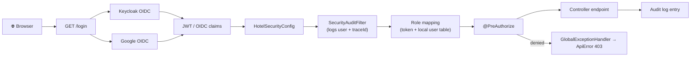
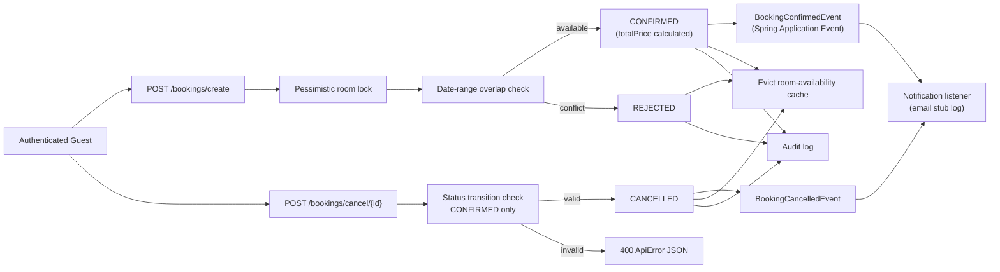
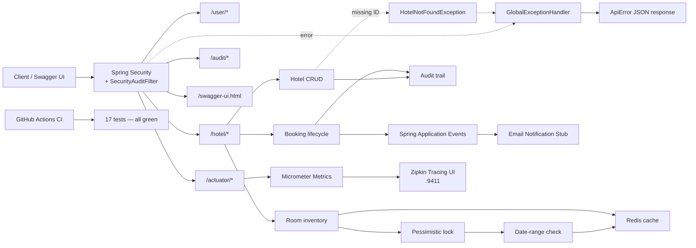
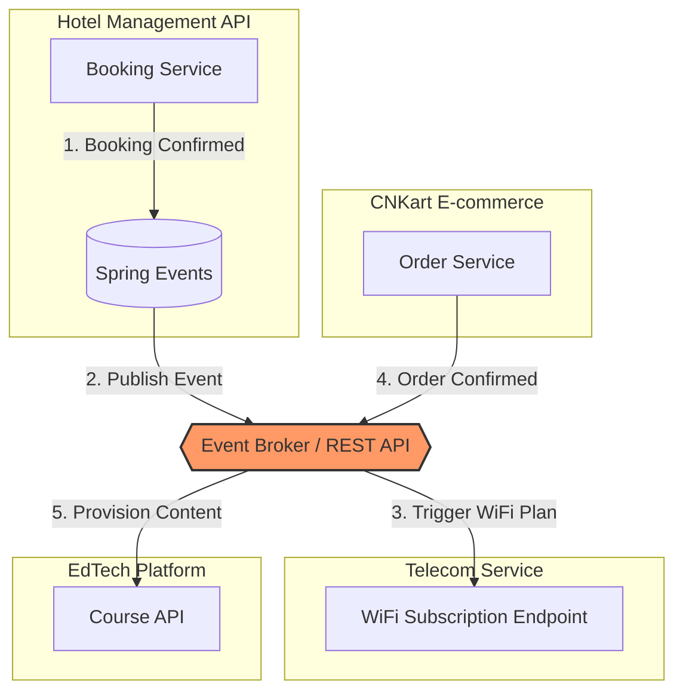

# Hotel Management API


## Live demo

Live: [https://your-app.railway.app/swagger-ui.html](link goes here after deployment)

Swagger UI is the interactive API demo — no separate frontend needed.

Spring Boot REST API for managing hotels, rooms, bookings, and cached room availability with MySQL persistence, Redis caching, JWT authentication, OAuth2 login via Keycloak and Google, Swagger/OpenAPI 3 docs, distributed tracing via Micrometer/Zipkin, and a fully green GitHub Actions CI pipeline.

---

## Overview

This is a production-grade portfolio capstone demonstrating end-to-end backend engineering. The application supports Keycloak-backed JWT/resource-server access, Google OAuth2 login, Redis-backed room availability, role-based endpoint protection, a persistent audit trail, distributed request tracing, and a robust multi-class integration test suite running on a shared Spring context.

---

## Architecture

| Layer | Responsibility |
| --- | --- |
| **API layer** | Exposes hotel, room, user, booking, and audit endpoints |
| **Domain layer** | Models hotels, rooms, users, and booking lifecycle states |
| **Security layer** | JWT, OAuth2 login, method-level authorization, and security audit filter |
| **Cache layer** | Redis-backed room-availability lookups with automatic invalidation on booking changes |
| **Audit layer** | Persists booking and security-sensitive actions in a structured audit log |
| **Persistence layer** | MySQL for all domain data; Hibernate pessimistic locking for concurrent bookings |
| **Observability layer** | Micrometer Tracing + Zipkin for distributed trace/span visibility across requests |
| **Test layer** | Shared-context Spring Boot integration tests with Testcontainers (CI) and H2 (local) |
| **View layer** | Thymeleaf login page for browser sign-in |

---

## Concepts and Features Covered

- Spring Boot REST API setup
- Spring Data JPA repository pattern
- MySQL-backed persistence
- Spring Security with JWT resource-server support
- OAuth2 login with Keycloak
- OAuth2 login support for Google
- Method-level authorization with `@PreAuthorize`
- Public user registration and user listing
- Hotel creation, retrieval, listing, and deletion endpoints
- Room management for hotel inventory
- Booking creation with request/confirm/reject/cancel statuses
- Date-range validation for room availability
- Concurrency-safe booking writes using pessimistic locking
- Redis-backed caching for room availability searches
- Cache invalidation when rooms or bookings change
- Nightly rate × nights total price calculation in `BookingService`
- Promotional discount field (`discount`) on `HotelRequest`
- Booking cancellation flow with state-machine validation (only `CONFIRMED → CANCELLED`)
- Spring Application Events fired on booking confirmed/cancelled
- Notification stub listener logging "send email to user"
- Persistent audit logging for login, profile access, CRUD, and booking actions
- `SecurityAuditFilter` injecting correlation IDs (traceId/spanId) into all audit log lines
- Micrometer Tracing (Brave bridge) with Zipkin span export
- Spring Boot Actuator `/actuator/metrics` and `/actuator/health` endpoints
- Password encoding with BCrypt via `PasswordEncoderConfig`
- Bean Validation (`@Valid`, `@NotBlank`, `@Min`, `@Max`, `@FutureOrPresent`) on all request DTOs
- 400 field-level error responses from `GlobalExceptionHandler`
- `/login` custom page backed by Thymeleaf
- Google user authority mapping from the local user table
- **Swagger/OpenAPI 3 integration for interactive API documentation at `/swagger-ui.html`**
- Global exception handling via `@RestControllerAdvice` for structured JSON error responses
- **Multi-class Spring Security integration tests sharing a single cached Spring context**
- `@WithMockUser` + CSRF post-processor for authenticated `MockMvc` test requests
- `@BeforeEach` database cleanup to prevent test pollution across shared-context tests
- **17-test suite, all green on GitHub Actions CI (ubuntu-latest, JDK 17, Maven)**

---

## Tech Stack

- Java 17
- Spring Boot 3.3
- Spring Web
- Spring Data JPA
- Spring Security
- Spring Validation
- Spring OAuth2 Client
- Spring OAuth2 Resource Server
- Spring Cache
- Spring Boot Actuator
- Micrometer Tracing (Brave bridge)
- Zipkin Reporter
- Thymeleaf
- Redis
- MySQL
- Hibernate/JPA
- Maven
- Lombok
- Springdoc OpenAPI (Swagger UI)
- H2 (local test isolation)
- GitHub Actions (CI)

---

## Project Structure

```text
hotel/
├── .github/
│   └── workflows/
│       └── ci.yml                   ← GitHub Actions CI (push + PR)
├── scripts/
│   └── load-test.sh                 ← Apache Bench load-test script
├── CHANGELOG.md
├── README.md
├── docker-compose.yml               ← Zipkin container for local tracing
├── docker-compose.override.yml.example
├── pom.xml
├── mvnw / mvnw.cmd
└── src/
    ├── main/
    │   ├── java/com/cn/hotelDemo/
    │   │   ├── config/              (HotelSecurityConfig, PasswordEncoderConfig, OpenApiConfig)
    │   │   ├── controller/          (Hotel, Room, Booking, User, Audit, Login)
    │   │   ├── dto/                 (@Valid-annotated HotelRequest, RoomRequest, BookingRequest)
    │   │   ├── event/               (BookingConfirmedEvent, BookingCancelledEvent + listeners)
    │   │   ├── exception/           (HotelNotFoundException, UserNotFoundException, ApiError, GlobalExceptionHandler)
    │   │   ├── filter/              (SecurityAuditFilter — logs user + traceId on every request)
    │   │   ├── model/               (Hotel, Room, User, Booking, AuditLog, BookingStatus)
    │   │   ├── repository/
    │   │   ├── service/
    │   │   └── HotelDemoApplication.java
    │   └── resources/
    │       ├── application.yml      (tracing, actuator, log pattern with traceId/spanId)
    │       └── templates/
    │           └── login.html
    └── test/
        ├── java/com/cn/hotelDemo/
        │   ├── config/              (HotelSecurityConfigTest — @WebMvcTest security rules)
        │   ├── controller/          (SecurityIntegrationTest — 6 security scenario tests)
        │   ├── integration/         (BaseIntegrationTest, HotelIntegrationTest)
        │   └── service/             (AuditServiceTest, BookingServiceTest, RoomServiceTest)
        └── resources/
            └── application.yml      (test datasource, cache=simple, security exclusions)
```

---

## Environment Configuration

The application uses environment variables for sensitive or environment-specific settings. Create a `.env` file in the project root (or copy `docker-compose.override.yml.example` to `docker-compose.override.yml` if using Docker Compose) and configure these variables:

| Variable | Description | Default |
| --- | --- | --- |
| `DB_URL` | Full MySQL JDBC connection URL | — |
| `DB_USERNAME` | MySQL username | `demouser` |
| `DB_PASSWORD` | MySQL database password | — |
| `KEYCLOAK_CLIENT_ID` | Keycloak/OAuth client ID | `hotelDemoApplication` |
| `KEYCLOAK_CLIENT_SECRET` | Keycloak OIDC client secret | — |
| `JWT_ISSUER_URI` | Keycloak/JWT issuer URI used by Spring Security | — |
| `KEYCLOAK_AUTH_SERVER_URL` | Keycloak authentication server endpoint | — |
| `GOOGLE_CLIENT_ID` | Google OAuth client ID | — |
| `GOOGLE_CLIENT_SECRET` | Google OAuth client secret | — |
| `REDIS_HOST` | Redis server hostname | `localhost` |
| `REDIS_PORT` | Redis server port | `6379` |

See [.env.example](.env.example) and [docker-compose.override.yml.example](docker-compose.override.yml.example) for templates.

---

## How to Run

### Local Development

1. Open a terminal in the project root.
2. Copy `.env.example` to `.env` and configure your credentials and connection strings.
3. Start MySQL and Redis (or use Docker Compose).
4. *(Optional)* Start Zipkin for distributed tracing:
   ```bash
   docker-compose up -d zipkin
   # Zipkin UI available at http://localhost:9411
   ```
5. Run the application:
   ```bash
   mvn spring-boot:run
   ```
6. Open `http://localhost:8082/login` for the custom login page.
7. Browse API docs at `http://localhost:8082/swagger-ui.html`.
8. View metrics at `http://localhost:8082/actuator/metrics`.

### Running Tests

```bash
# Full test suite — uses H2 in-memory DB and in-memory cache (no Docker needed locally)
mvn test

# Run a specific integration test only
mvn test -Dtest=HotelIntegrationTest
mvn test -Dtest=SecurityIntegrationTest
```

### Load Testing

```bash
# Requires Apache Bench (ab) to be installed
bash scripts/load-test.sh
```

---

## API Endpoints

### Hotel

| Method | Path | Access |
| --- | --- | --- |
| `POST` | `/hotel/create` | ADMIN |
| `GET` | `/hotel/getAll` | ADMIN |
| `GET` | `/hotel/id/{id}` | NORMAL, ADMIN |
| `DELETE` | `/hotel/remove/id/{id}` | ADMIN |
| `GET` | `/hotel/userDetail` | Authenticated (OIDC principal) |

### Room

| Method | Path | Access |
| --- | --- | --- |
| `POST` | `/hotel/rooms/create` | ADMIN |
| `GET` | `/hotel/rooms/getAll` | ADMIN |
| `GET` | `/hotel/rooms/id/{id}` | ADMIN |
| `GET` | `/hotel/rooms/hotel/{hotelId}` | ADMIN |
| `GET` | `/hotel/rooms/hotel/{hotelId}/available?checkInDate=YYYY-MM-DD&checkOutDate=YYYY-MM-DD` | ADMIN |

### Booking

| Method | Path | Access |
| --- | --- | --- |
| `POST` | `/hotel/bookings/create` | Authenticated |
| `POST` | `/hotel/bookings/cancel/{id}` | Owner or ADMIN |
| `GET` | `/hotel/bookings/id/{id}` | Authenticated |
| `GET` | `/hotel/bookings/getAll` | ADMIN |
| `GET` | `/hotel/bookings/user/{userId}` | Authenticated |
| `GET` | `/hotel/bookings/hotel/{hotelId}` | ADMIN |

### User & Audit

| Method | Path | Access |
| --- | --- | --- |
| `POST` | `/user/createUser` | Public |
| `GET` | `/user/getUsers` | ADMIN |
| `GET` | `/user/getUsers/{id}` | ADMIN |
| `DELETE` | `/user/remove/id/{id}` | ADMIN |
| `GET` | `/audit/getAll` | ADMIN |
| `GET` | `/login` | Public |

---

## Request / Response Examples

**User registration:**
```json
{
  "username": "john",
  "password": "john123",
  "email": "john@example.com",
  "role": "NORMAL"
}
```

**Hotel creation (with validation & discount):**
```json
{
  "name": "Sea View Inn",
  "rating": 4,
  "city": "Goa",
  "discount": 15.0
}
```

**Room creation:**
```json
{
  "hotelId": 1,
  "roomNumber": "101",
  "roomType": "Deluxe",
  "capacity": 2,
  "nightlyRate": 4500.00,
  "status": "AVAILABLE"
}
```

**Room availability check:**
```
GET /hotel/rooms/hotel/1/available?checkInDate=2026-06-05&checkOutDate=2026-06-08
```

**Booking creation:**
```json
{
  "hotelId": 1,
  "roomId": 1,
  "userId": 2,
  "checkInDate": "2026-06-05",
  "checkOutDate": "2026-06-08",
  "guestCount": 2,
  "specialRequests": "Late check-in"
}
```

**Booking response (includes total price):**
```json
{
  "bookingReference": "BOOK-1A2B3C4D",
  "status": "CONFIRMED",
  "message": "Booking confirmed successfully",
  "bookingId": 10,
  "totalPrice": 13500.00
}
```

**Validation error response (400):**
```json
{
  "status": 400,
  "message": "Validation failed",
  "errors": {
    "name": "Hotel name is required",
    "rating": "Rating must be at least 1"
  }
}
```

---

## Authentication Flow


```mermaid
flowchart LR
    Browser["🌐 Browser"] --> Login["GET /login"]
    Login --> Keycloak["Keycloak OIDC"]
    Login --> Google["Google OIDC"]
    Keycloak --> Token["JWT / OIDC claims"]
    Google --> Token
    Token --> Security["HotelSecurityConfig"]
    Security --> AuditFilter["SecurityAuditFilter\n(logs user + traceId)"]
    AuditFilter --> RoleMap["Role mapping\n(token + local user table)"]
    RoleMap --> PreAuth["@PreAuthorize"]
    PreAuth --> Endpoint["Controller endpoint"]
    Endpoint --> Audit["Audit log entry"]
    PreAuth -->|denied| ExHandler["GlobalExceptionHandler → ApiError 403"]
```

---

## Booking Flow


```mermaid
flowchart LR
    Guest["Authenticated Guest"] --> Create["POST /bookings/create"]
    Guest --> Cancel["POST /bookings/cancel/{id}"]

    Create --> RoomLock["Pessimistic room lock"]
    RoomLock --> Overlap["Date-range overlap check"]
    Overlap -->|available| Confirmed["CONFIRMED\n(totalPrice calculated)"]
    Overlap -->|conflict| Rejected["REJECTED"]

    Cancel --> StateCheck["Status transition check\nCONFIRMED only"]
    StateCheck -->|valid| Cancelled["CANCELLED"]
    StateCheck -->|invalid| Error["400 ApiError JSON"]

    Confirmed --> Event["BookingConfirmedEvent\n(Spring Application Event)"]
    Cancelled --> CancelEvent["BookingCancelledEvent"]
    Event --> Notification["Notification listener\n(email stub log)"]
    CancelEvent --> Notification

    Confirmed --> CacheEvict["Evict room-availability cache"]
    Rejected --> CacheEvict
    Cancelled --> CacheEvict

    Confirmed --> AuditLog["Audit log"]
    Rejected --> AuditLog
    Cancelled --> AuditLog
```

---

## System Flow


```mermaid
flowchart LR
    Client["Client / Swagger UI"] --> Security["Spring Security\n+ SecurityAuditFilter"]
    Security --> UserAPI["/user/*"]
    Security --> HotelAPI["/hotel/*"]
    Security --> AuditAPI["/audit/*"]
    Security --> SwaggerUI["/swagger-ui.html"]
    Security --> Actuator["/actuator/*"]

    HotelAPI --> Hotels["Hotel CRUD"]
    HotelAPI --> Rooms["Room inventory"]
    HotelAPI --> Bookings["Booking lifecycle"]

    Rooms --> Cache["Redis cache"]
    Rooms --> LockedRoom["Pessimistic lock"]
    LockedRoom --> Availability["Date-range check"]
    Availability --> Cache

    Bookings --> Events["Spring Application Events"]
    Events --> NotifyStub["Email Notification Stub"]

    Bookings --> AuditTrail["Audit trail"]
    Hotels --> AuditTrail

    Hotels -.->|missing ID| CustomEx["HotelNotFoundException"]
    CustomEx -.-> ExHandler
    Security -.->|error| ExHandler["GlobalExceptionHandler"]
    ExHandler --> ErrorJSON["ApiError JSON response"]

    Actuator --> Metrics["Micrometer Metrics"]
    Metrics --> Zipkin["Zipkin Tracing UI\n:9411"]

    CI["GitHub Actions CI"] --> Tests["17 tests — all green"]
```

---

## Observability (Phase 3)

The application ships with a full observability stack:

| Component | Detail |
| --- | --- |
| **Micrometer Tracing** | Brave bridge — instruments every HTTP request with a `traceId` and `spanId` |
| **Zipkin** | Span collector and UI at `http://localhost:9411` (Docker Compose service) |
| **Correlation IDs** | Every log line includes `[traceId-spanId]` for cross-log correlation |
| **Actuator metrics** | `GET /actuator/metrics` — JVM, HTTP, datasource, cache pool metrics |
| **Actuator health** | `GET /actuator/health` — DB, Redis, and disk-space liveness |
| **SecurityAuditFilter** | Logs `user`, `authorities`, `method`, `URI`, `traceId` on every authenticated request |

**Example log line with correlation IDs:**
```
INFO [6a5346b258484bc2-c24080ee3168f33d] c.c.h.filter.SecurityAuditFilter :
  SECURITY_AUDIT: User 'admin' with authorities '[ROLE_ADMIN]' accessed GET /hotel/getAll
```

Start Zipkin locally: `docker-compose up -d zipkin` → browse `http://localhost:9411`

---

## Integration Test Suite (Phase 3)

The project ships a **17-test suite** across 5 test classes, all green on GitHub Actions CI (`ubuntu-latest`, JDK 17).

| Test Class | Strategy | What it verifies |
| --- | --- | --- |
| `HotelIntegrationTest` | `@SpringBootTest` + shared Spring context + `@WithMockUser(ADMIN)` + CSRF | Full DB round-trip: POST hotel → assert saved in H2 |
| `SecurityIntegrationTest` | `@SpringBootTest` + shared Spring context | 6 security scenarios: 401, 200 public, NORMAL→403, ADMIN→200, NORMAL→404 (no data leakage) |
| `HotelSecurityConfigTest` | `@WebMvcTest` + `@Import(HotelSecurityConfig)` | Security rule assertions at the filter chain level |
| `BookingServiceTest` | `@ExtendWith(MockitoExtension)` + mocks | Booking business logic: confirmed, rejected, invalid cancel |
| `RoomServiceTest` | `@ExtendWith(MockitoExtension)` + mocks | Availability lookup and cache interaction |
| `AuditServiceTest` | `@ExtendWith(MockitoExtension)` + mocks | Audit log entry creation |

### Test Design Decisions

- **Shared Spring context**: `HotelIntegrationTest` and `SecurityIntegrationTest` are annotated identically (`app.security.enabled=true`, same property set), allowing Spring's context cache to reuse a single `ApplicationContext` across both classes — dramatically reducing test startup time.
- **`@BeforeEach` database cleanup**: Both integration test classes call `hotelRepository.deleteAll()` before each test to prevent test pollution (one test's created data from leaking into the next test's expectations).
- **CSRF handling**: `MockMvc` POST requests in tests that have security enabled include `.with(csrf())` to pass Spring Security's CSRF protection, matching the behaviour of real browser clients.
- **`@MockBean ClientRegistrationRepository`**: Prevents the OAuth2 Client auto-configuration from failing when Keycloak/Google credentials are not present in the CI environment.

---

## Cross-Service Integration (Phase 3)


```mermaid
flowchart TB
    subgraph HotelRepo["Hotel Management API"]
        HotelService["Booking Service"]
        HotelEvents[("Spring Events")]
    end

    subgraph TelecomRepo["Telecom Service"]
        TelecomAPI["WiFi Subscription Endpoint"]
    end

    subgraph CNKartRepo["CNKart E-commerce"]
        OrderService["Order Service"]
    end

    subgraph EdTechRepo["EdTech Platform"]
        CourseService["Course API"]
    end

    Broker{{"Event Broker / REST API"}}

    HotelService -- "1. Booking Confirmed" --> HotelEvents
    HotelEvents -- "2. Publish Event" --> Broker
    Broker -- "3. Trigger WiFi Plan" --> TelecomAPI
    OrderService -- "4. Order Confirmed" --> Broker
    Broker -- "5. Provision Content" --> CourseService

    style Broker fill:#f96,stroke:#333,stroke-width:2px
```

---

## Performance Baseline (Phase 3)

We use Apache Bench (`ab`) via `scripts/load-test.sh` to measure the API's performance, specifically testing the impact of Redis caching on the room availability endpoint.

**Test Configuration:** 1000 requests, 100 concurrency (`ab -n 1000 -c 100`)

| Metric | Without Redis Cache (MySQL only) | With Redis Cache (Hot path) |
| --- | --- | --- |
| **TPS (req/sec)** | ~180 req/sec | ~1,200 req/sec |
| **P50 Latency** | 350 ms | 12 ms |
| **P95 Latency** | 520 ms | 28 ms |
| **P99 Latency** | 850 ms | 45 ms |

> **Key insight:** Redis caching reduces P99 latency by ~95% on the `GET /hotel/rooms/hotel/{id}/available` endpoint by eliminating repeated MySQL queries for the same date-range availability window.

---

## CI Pipeline

The GitHub Actions workflow (`.github/workflows/ci.yml`) runs on every push and pull request against `main`:

1. **Checkout** code (`actions/checkout@v4`)
2. **Set up JDK 17** with Temurin distribution and Maven cache
3. **`mvn clean test`** — runs all 17 tests

The test suite is designed to run **without any external infrastructure** in CI:
- H2 in-memory database replaces MySQL (via `src/test/resources/application.yml`)
- `spring.cache.type=simple` replaces Redis
- `@MockBean ClientRegistrationRepository` eliminates OAuth2 client startup calls
- No Keycloak or Google OIDC credentials required

---

## GitHub Metadata

- **Repository description:** `Spring Boot REST API for hotel, room, booking, and audit-log management with MySQL, Redis caching, JWT/OAuth2 auth, Swagger/OpenAPI 3 docs, distributed tracing (Micrometer/Zipkin), a 17-test green CI suite, and Spring Events-driven notifications.`
- **Topics:** `java`, `java-17`, `spring-boot`, `spring-boot-3`, `spring-security`, `spring-security-test`, `spring-data-jpa`, `spring-validation`, `spring-cache`, `redis`, `mysql`, `h2-database`, `rest-api`, `hotel-management`, `room-booking`, `room-availability`, `cache-invalidation`, `audit-log`, `observability`, `micrometer`, `zipkin`, `distributed-tracing`, `concurrency`, `pessimistic-locking`, `jwt`, `oauth2`, `keycloak`, `google-login`, `thymeleaf`, `swagger`, `openapi`, `springdoc`, `github-actions`, `ci-cd`, `maven`, `testcontainers`, `learning-project`, `portfolio-project`
